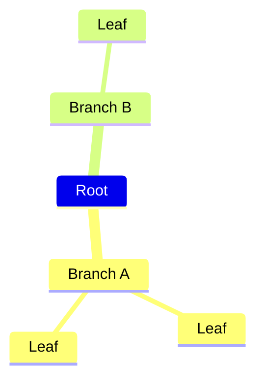

# Study Assistant

Turn already-textual study material into exam-focused outputs. Pick a mode and the skill applies the corresponding rule set.

If the material isn't text yet (PDF, scan, video), run an extraction step first:
- PDF: `ocr-and-documents` skill
- Image/scan: `ocr-and-documents` or `pdf` skill
- YouTube/lecture: `youtube-content` skill

## Modes

| Mode | What it produces |
|---|---|
| `transcribe` | Verbatim markdown of the source, metadata noise stripped |
| `lecture` | Formal academic prose, structured as a professor's lecture |
| `eli5` | Plain-language explanation, step-by-step, no metaphors |
| `flashcard` | Two-column markdown table: term/question → definition/answer |
| `mindmap` | Mermaid `mindmap` code block, no extra text |
| `quiz` | 5-10 mixed MCQ + short-answer, with answer key |
| `essay` | 3-4 essay prompts (~200 words each) with sample answers |
| `study-notes` | Exam-focused, topic-organized, with concepts + links |

## Invocation

Tell the agent the mode and supply the material. Examples:

```
Use $study-assistant in lecture mode on this material:
<paste text or reference a file>
```

```
$study-assistant: quiz mode on the attached lecture notes
```

```
Use $study-assistant in study-notes mode on the OCR output in /tmp/notes.md
```

If no mode is specified, default to `study-notes`.

## Pre-flight: Clean Source Text

Before generating, remove only clear metadata:
- Instructor details
- Headers and footers
- Page numbers
- Timestamps
- Course codes

Preserve educational content: concepts, definitions, examples. If a fragment is too broken to recover confidently, omit it rather than guess.

## Generation Rules (apply to all modes)

- Base all factual content only on the user-provided material. No outside facts, theories, or claims.
- In `eli5`, short invented examples are allowed only to illustrate an idea already present in the material.
- Do not mention the source material. Present the content directly.
- Output markdown.
- Use LaTeX with `$...$` (inline) and `$$...$$` (display) for math.
- Do not include conversational intros or conclusions.

## Per-mode Rules

### transcribe

Goal: Convert study material into structured markdown, verbatim.

- Reproduce educational content word-for-word. No summarising, paraphrasing, simplifying, reordering, or shortening.
- Preserve headings, bullets, numbering, and visible structure.
- Keep markdown aligned with the source organization.
- Remove only metadata noise (instructors, headers, footers, page numbers, timestamps, course codes).
- If a fragment is too broken to recover, omit it rather than guess.

### lecture

Goal: Present the material as a clear, formal lecture.

- Formal academic prose. No roleplay, no audience address.
- Do not mention the source, notes, slides, or lecture.
- Open with the main topic and its importance.
- Explain ideas in logical order, basic to advanced.
- Turn fragmented points into connected paragraphs with clear transitions.
- Preserve technical terms; explain key distinctions.
- Emphasise how things work, why they matter, how ideas relate.
- Prefer paragraphs. Use bullets only for steps, definitions, comparisons.
- End with a short synthesis of the main ideas.

### eli5

Goal: Explain in simple, direct language.

- Assume the reader is new to the topic.
- Start with the main point in 1-2 short sentences.
- Explain one idea at a time, step by step.
- Define technical terms in plain words on first use.
- Short examples only — no analogies, metaphors, or story framing.
- Examples may be invented only to show an idea already in the material.
- Don't use "imagine" or comparisons.
- Keep it accurate and grounded in the material.
- Include: what it is, how it works, key terms, concrete examples, why it matters.

### flashcard

Goal: Exam-ready flashcards.

- High-value only: terms, definitions, formulas, distinctions, core concepts.
- Front: single clear prompt.
- Back: short, direct, sufficient for revision.
- No duplicates or heavy overlap.
- Output only a two-column markdown table with these exact headers:
  - `Front (Term/Question)`
  - `Back (Definition/Answer)`

### mindmap

Goal: Hierarchical concept map.

- Output only a ` ```mermaid ` code block, no extra text.
- First line inside the block must be exactly `mindmap`.
- Hierarchy through indentation only.
- No bullets, node IDs, connectors, shape syntax.
- Labels: letters, numbers, spaces only. No parentheses, brackets, braces, quotes, punctuation, colons.

### quiz

Goal: Practice questions testing understanding and application.

- 5-10 questions, mixed MCQ (4 options) and short-answer.
- Prioritise explanation, comparison, application over recall.
- Questions clear, unambiguous, answerable from the material.
- End with an `Answer Key` section giving the correct answer for every question.

### essay

Goal: Exam-style essay practice.

- 3-4 essay questions.
- Each suitable for ~200-word responses.
- At least one conceptual/theoretical + one applied/integrative.
- Strong academic verbs: Discuss, Evaluate, Compare and contrast, Explain.
- ~200-word sample answer per question.
- Both questions and sample answers grounded strictly in the material.

### study-notes

Goal: Exam-focused study notes from the content.

- Organise by major topic with clear markdown headers.
- Per topic include:
  - clear explanation of the concept
  - essential facts, definitions, formulas most relevant for exams
  - links to related concepts, contrasts, dependencies
- Prioritise understanding, relationships, exam relevance over rote listing.
- Logical, progressive flow so later sections build on earlier ones.

## Example Output Skeletons

### flashcard

```markdown
| Front (Term/Question) | Back (Definition/Answer) |
| --- | --- |
| What is …? | … |
| Define X. | … |
```

### mindmap

````markdown

````

### quiz

```markdown
## Q1
…

## Answer Key
1. …
```

## Tips

- Long source material? The `transcribe` mode preserves more content, `study-notes` compresses aggressively. Pick based on what the user needs.
- For mindmaps, if the source has more than ~30 concepts, ask the user whether to focus on a subset before generating.
- If a mode produces a mermaid diagram the renderer can't show, fall back to a bullet-list mindmap and note the swap.
